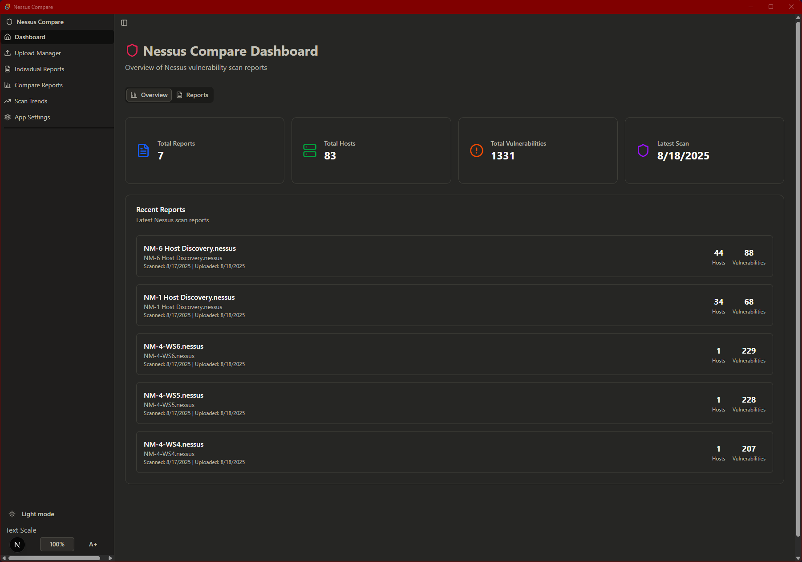
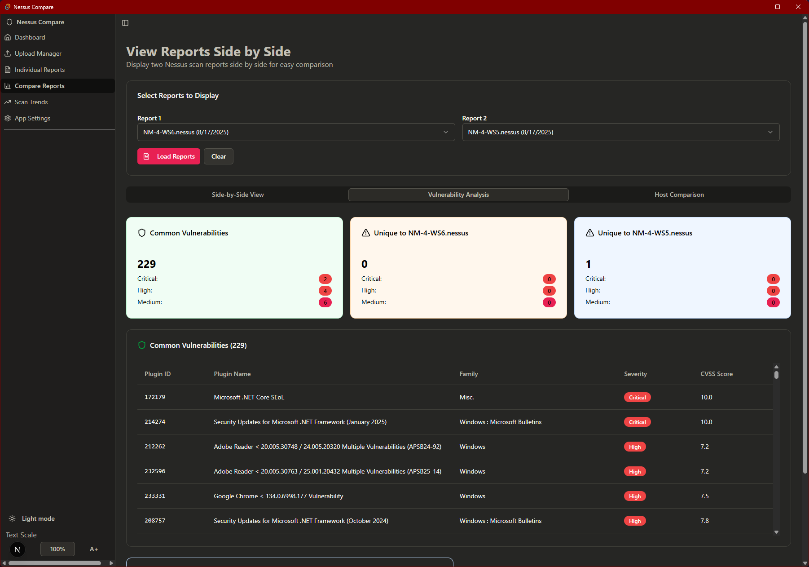

# Nessus Compare Tool (v1.0.2)

A desktop application built with React, TypeScript, and Tauri for comparing Nessus vulnerability scan reports. It enables side-by-side analysis of two scans, highlights deltas, and exports a rich, interactive HTML report.

## Key Capabilities

- Load and select two Nessus scan reports to compare
- Delta analysis (across common hosts):
  - New vulnerabilities (in Report 2, not in Report 1)
  - Resolved vulnerabilities (in Report 1, not in Report 2)
  - Persistent vulnerabilities (present in both)
- Vulnerability sets comparison (by plugin IDs):
  - Common vulnerabilities across both reports
  - Unique to Report 1
  - Unique to Report 2
- Host comparison:
  - Common hosts and their vulnerability counts
  - Hosts only in Report 1 / only in Report 2
- Side-by-side view of report metadata and summaries
- Colored severity badges (Critical/High/Medium/Low/Info) for quick visual scanning
- Enhanced table styling for readability (striped rows, sticky headers)
- Interactive tabs in-app (Delta, Host Comparison, Side-by-Side, Vulnerability Sets)
- Export to standalone HTML:
  - All tab content captured (panels force-mounted during export)
  - Tabs remain interactive in the exported file via embedded vanilla JS
  - Styling preserved via Tailwind CDN
- Native file save dialog and writing via Tauri plugins

## Screenshots




## Development

### Prerequisites
- Node.js (LTS recommended)
- pnpm or npm
- Rust toolchain (required by Tauri)
- Platform toolchain for Tauri (see Tauri docs for OS-specific setup)

1. Clone the repository
2. Install dependencies:
   ```bash
   npm install
   # or
   pnpm install
   ```
3. Run the development app (Next.js + Tauri dev):
   ```bash
   npm run dev
   # or
   pnpm dev
   ```
4. Build the desktop app with Tauri:
   ```bash
   npm run tauri build
   # or
   pnpm tauri build
   ```

## Usage

- Launch the app and open the Compare page.
- Select two reports and click "Load Reports".
- Navigate tabs:
  - Delta Report: new/resolved/persistent + detailed tables
  - Host Comparison: common/unique hosts and counts
  - Side-by-Side: metadata and summaries
  - Vulnerability Sets: common and unique plugins across reports
- Click "Print Reports" to export a standalone HTML report:
  - Choose a save location via the native dialog
  - Open the saved HTML file; tabs remain clickable/interactive

## Technologies

- React
- TypeScript
- Tailwind CSS
- Tauri

## Version

- Current release: 1.0.2

## Notes

- Exported HTML includes embedded JavaScript to keep tabs interactive.
- Severity badges use explicit Tailwind utility colors to ensure consistent rendering in the exported report.

## Contributing

Contributions are welcome! Please fork the repository and submit pull requests.

## License

MIT License
