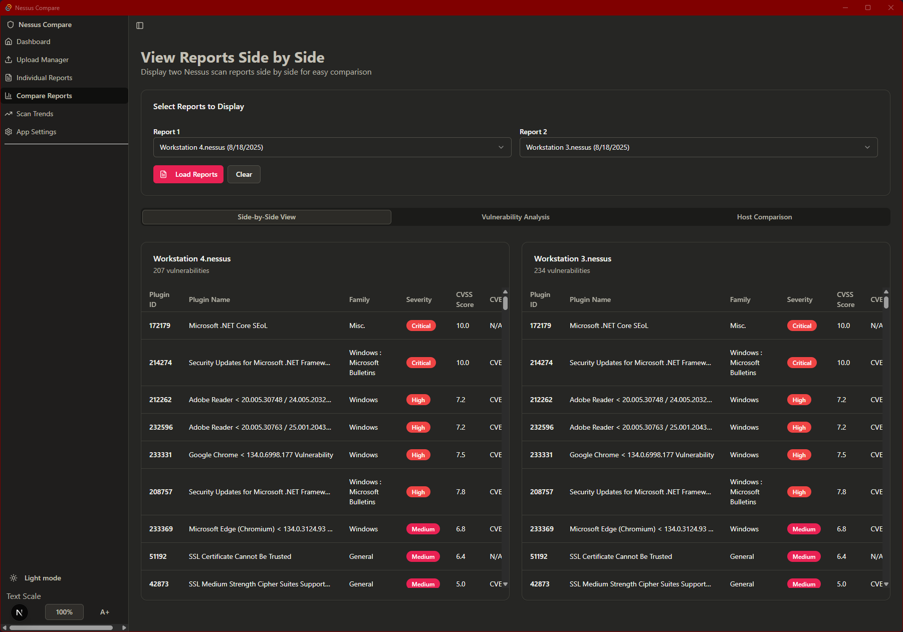

# Nessus Compare Tool

A desktop application built with React, TypeScript, and Tauri for comparing Nessus vulnerability scan reports. This tool allows users to select multiple scan reports, view trends in vulnerabilities over time, and compare scan data visually and in tabular form.

## Features

- Load and select multiple Nessus scan reports
- View severity distribution across selected scans using bar charts
- Track total findings over time with line charts
- Compare detailed vulnerability counts in a table
- Interactive UI with filtering and selection controls

## Screenshots




## Development Installation

1. Clone the repository
2. Install dependencies:
   ```bash
   npm install
   # or
   pnpm install
   ```
3. Run the development server:
   ```bash
   npm run dev
   # or
   pnpm dev
   ```
4. Build the desktop app with Tauri:
   ```bash
   npm run tauri build
   # or
   pnpm tauri build
   ```

## Usage

- Select reports from the list
- Load selected reports to view trends and comparisons
- Use the charts and tables to analyze vulnerabilities

## Technologies

- React
- TypeScript
- Tailwind CSS
- Recharts
- Tauri

## Contributing

Contributions are welcome! Please fork the repository and submit pull requests.

## License

MIT License
